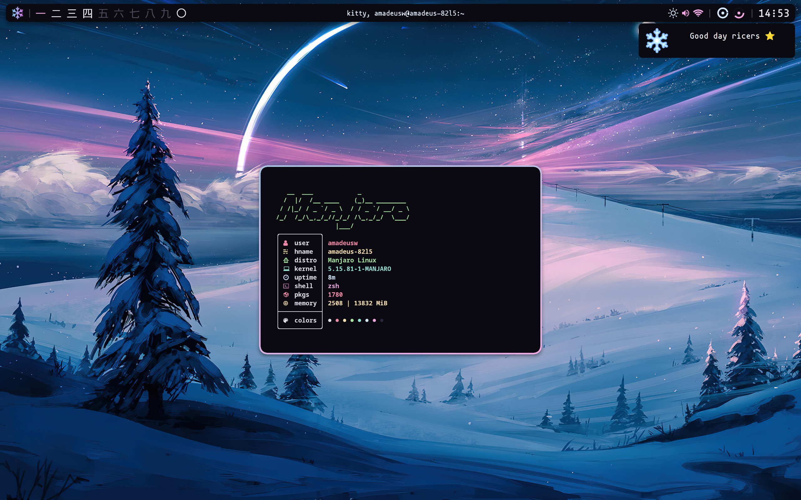
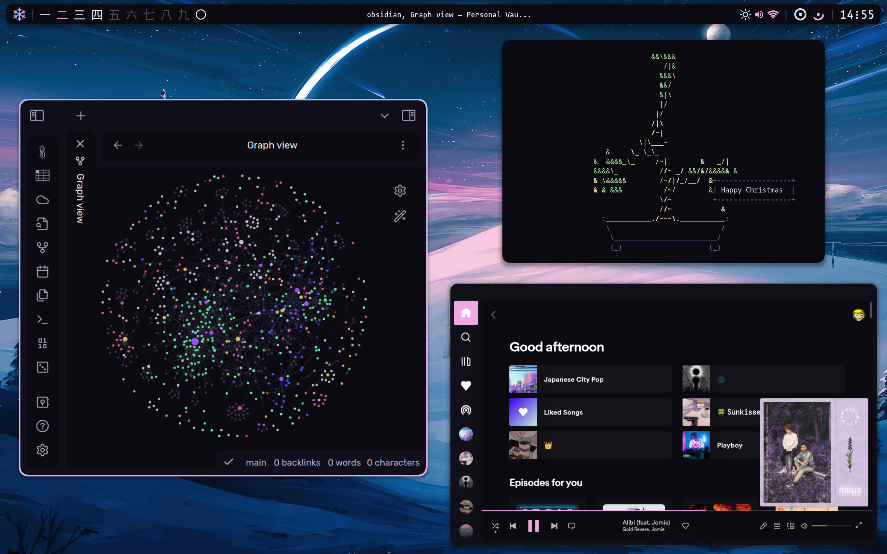
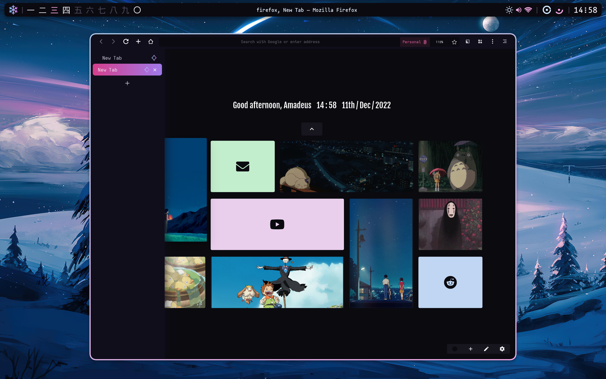
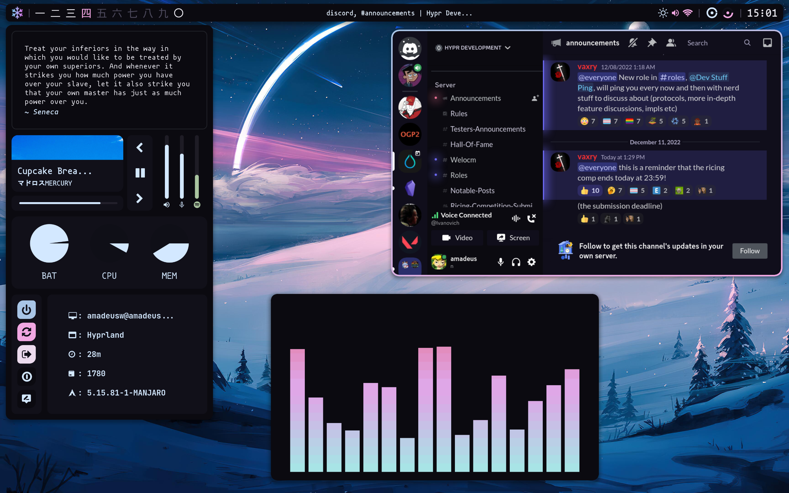

# Winter Theme For Hyprland

# Instructions
Install the main dotfiles ([dotfiles-hyprland](https://github.com/AmadeusWM/dotfiles-hyprland)), and add this theme to the `themes` folder. Then rename it to `winter` for everything to work.
# Themes Applications
The themes of all the applications themselves can be found in the `dots` folder.